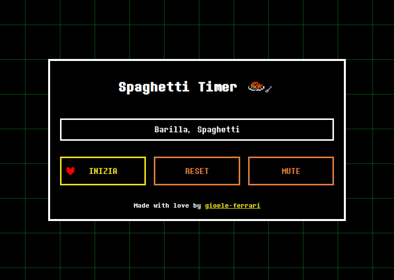

# Pasta Timer 🍝

Questa applicazione in JavaScript (Electron) permette di avviare un timer per la cottura della pasta, con uno stile ispirato all’interfaccia di battaglia del videogioco *Undertale*. L'app è pensata per essere minimale ma d'impatto, con elementi visuali e sonori che richiamano l'estetica retro-pixel.



---

## Struttura del Progetto

- **Interfaccia grafica**: Completamente customizzata con HTML, CSS e font ispirati a *Undertale*.
- **Timer con barra dinamica**: La barra gialla decresce visivamente in tempo reale.
- **Audio integrato**: Musica di sottofondo attivata all’avvio del timer.
- **Selezione della pasta**: L’utente può selezionare il tipo di pasta e avviare un conto alla rovescia.
- **Reset e feedback**: Possibilità di reimpostare il timer in qualsiasi momento.

---

## Funzionalità principali

1. **Avvio del Timer**: L’utente può selezionare il tempo di cottura da un menù a tendina e avviare il timer cliccando su "Inizia la cottura!".

2. **Reset**: In qualsiasi momento è possibile premere "Reimposta il timer!" per fermare la musica e resettare l'interfaccia.

3. **Combatti**: Una volta avviata la cottura dovrai schivare i proiettili in arrivo, altrimenti il tempo di cottura cambia rovinando il tuo delizioso piatto di pasta.

---

## Requisiti

- [Node.js](https://nodejs.org/) (v18 o superiore)
- npm
- macOS o Windows per build e avvio locale

---

## Avvio in locale

Per eseguire l'app localmente:

```bash
git clone https://github.com/gioele-ferrari/pasta-timer.git
cd pasta-timer
npm install
npm start
```

## Esportazione

```bash
npm run dist
```

C'è un piccolo problema quando si avvia l'app ovvero che richiede l'opzione da riga di comando `pasta-timer --no-sandbox` capirò poi come aggiorne questo problema.
